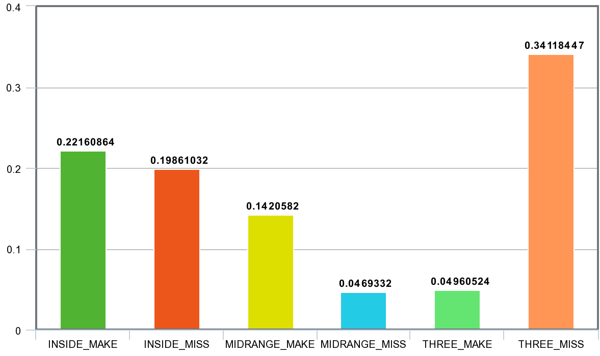

# DeepPlayByPlay

This repo contains model and data collection / preprocessing code to label NBA broadcast footage with play-by-play descriptions, using 3D ConvNet-based video classification.

### Classification performance
On a test set with 253 test examples (more or less evenly divided among 6 classes), the following accuracies were achieved:

| # classes        | Classes           | Accuracy  |
| ------------- |:-------------| :-----|
| 6      | (Inside/Midrange/Three) (Make/Miss) | 66% |
| 4      | (Two/Three) (Make/Miss)      | 74% |
| 2 | (Make/Miss)      | 91% |

### Examples:
The ultimate goal is continuous video classification, on running broadcast footage. However, I didn't have access to labelled data for non-field goal events (like free throws, rebounds, fouls, players running in transition). As a result, these examples use 90-frame videos of field-goal make/miss events - the only kind the model can currently identify.

 
