# Deep Play-by-Play

This repo contains model and data collection / preprocessing code to label NBA broadcast footage with play-by-play descriptions, using 3D ConvNet-based video classification.

To learn how to scrape labelled videos off NBA.com for similar projects, see [data_utils/README](data_utils/README.md).

### Classification performance
After training on about 3000 training examples (~6000 with augmentation), on a test set with 253 test examples (both sets somewhat evenly divided among 6 classes), the following accuracies were achieved:

| # classes        | Classes           | Accuracy  |
| ------------- |:-------------| :-----|
| 6      | (Inside/Midrange/Three) (Make/Miss) | 66% |
| 4      | (Two/Three) (Make/Miss)      | 74% |
| 2 | (Make/Miss)      | 91% |

### Running the code

You should be able to clone this repo, set up paths appropriately in `config.py`, and run training or inference. All dependencies for this project ship with either the Python 3 standard library or the everyday machine/deep learning toolkit (TensorFlow, keras, scikit-learn). To read videos from disk, I use [scikit-video](http://www.scikit-video.org/stable/io.html) io module, which you may need to install. Training data isn't hosted in this repo because it is quite large even after downsampling, and I don't have the [express written consent](https://www.youtube.com/watch?v=esj4vC1na7M) of the NBA.
However, the pre-trained weights file is available in the `weights` directory.

### Examples:

The ultimate goal is continuous video classification, on running broadcast footage. However, I didn't have access to labelled data for non-field goal events (like rebounds, free throws, players running down the court, Javale doing dumb shit, etc). As a result, these examples use 90-frame (at 8 fps, so about 11 seconds long) videos of field-goal make/miss events - the only kind the model can currently identify.

Since all data used for training and testing was from the 2017-18 season, I picked out several plays from [this video](https://www.youtube.com/watch?v=jjX71R69jlA) of the last 5 minutes of Spurs/Rockets Game 5 in the 2017 playoffs to see how accurately plays from a completely different season are classified:

 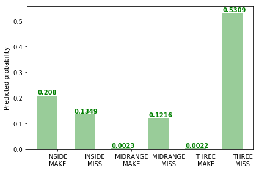
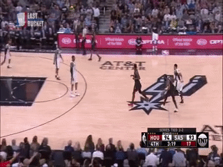 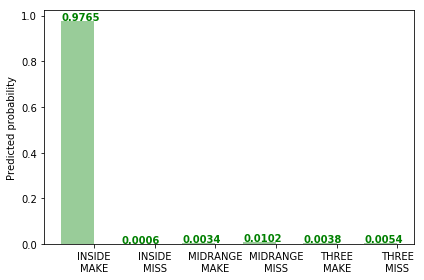
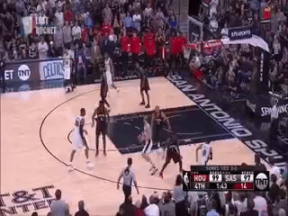 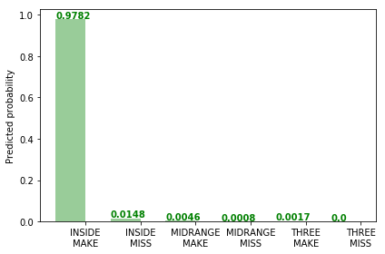
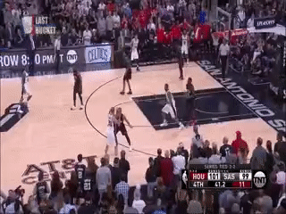 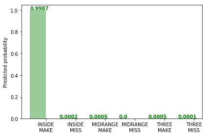

### Incorrect classification examples:
...because, like most things in life, this isn't perfect:

This Danny Green and-one is best classified as an `INSIDE_MAKE`, but `MIDRANGE_MAKE` is not a terribly bad guess:

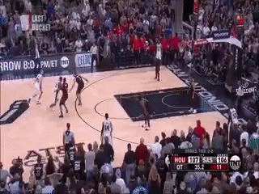 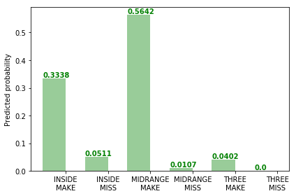

The following play is an offensive foul followed by a `MIDRANGE_MISS`, but is classified as more likely to be an `INSIDE_MAKE` (51%) than a `MIDRANGE_MISS` (27%):

 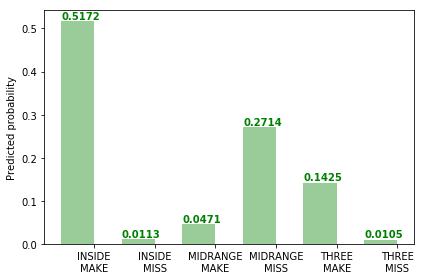

Sometimes, the classifier flat-out fails confidently :disappointed: :

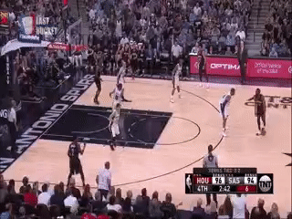 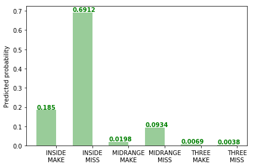
 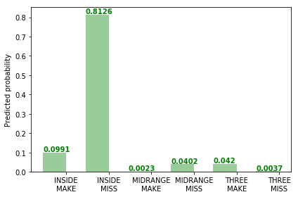

Note that some of these plays are quite difficult to judge properly at this resolution and frame rate, without sound. Now imagine that these videos are also black and white, and that is the kind of data that this model has been trained on. Therefore, it's unsurprising that it isn't very good, but working with higher quality videos requires significantly more computational resources :moneybag:.

### FAQ
I'll fill this out if and when people ask questions.

[Reddit discussion](https://www.reddit.com/r/nba/comments/9oyzhr/oc_a_side_project_ive_been_working_on_using_deep/)
